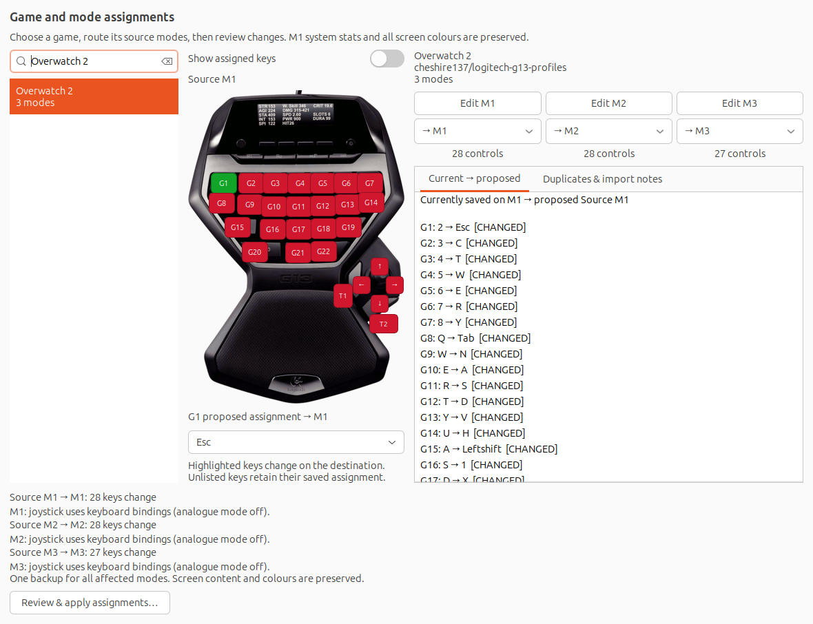
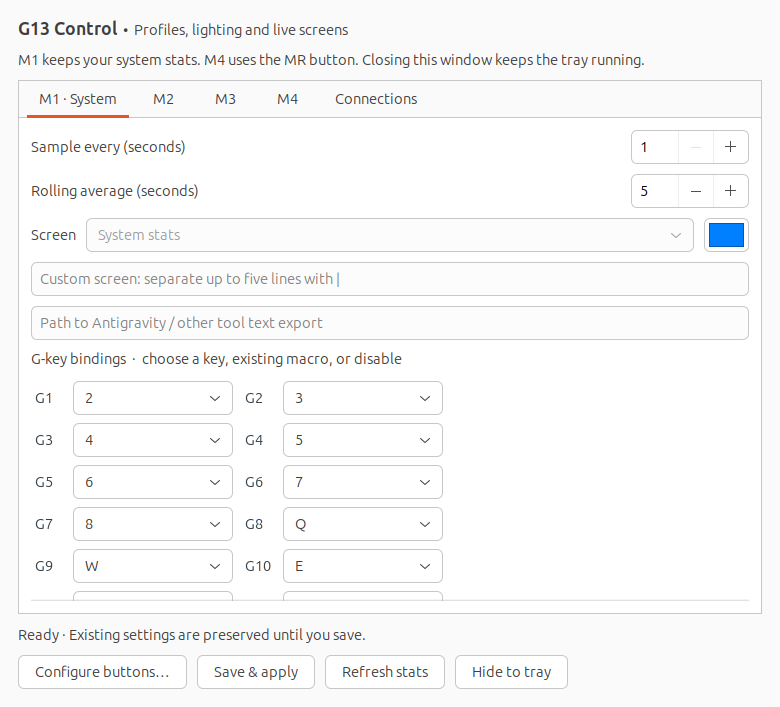
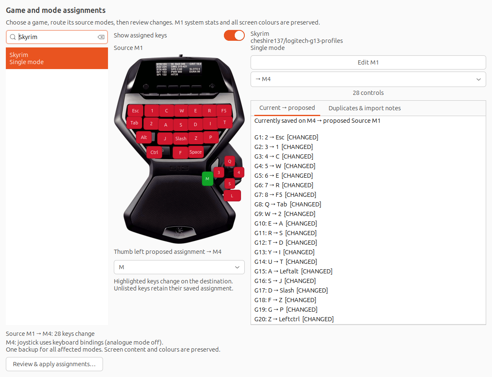
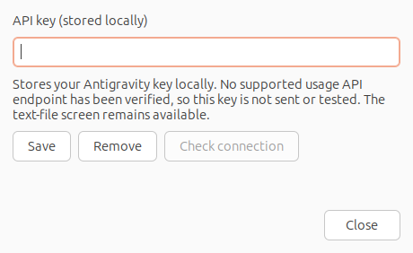

# Linux G13 Driver & G13 Control

A Linux userspace driver and native desktop tray app for the **Logitech G13**. Configure game keys, macros, joystick directions, four mode profiles, backlight colours and LCD statistics from your desktop panel.

**M1 keeps the built-in system statistics.** M2, M3 and M4 can display service statistics or your own text. The physical **MR** button selects M4.



*Actual GTK screenshots taken with disposable sample settings. They show the configuration app; they are not photographs of the hardware or authenticated service results.*

**Version 1.2.0** includes the LCD font fix, game-profile library, expanded configuration UI and configurable M1 rolling statistics. See the [changelog](CHANGELOG.md) and [remaining verification](TODO.md).

## What you can do

- Keep G13 Control in the panel notification area; closing its window leaves it running.
- Configure **M1–M4**, each with its own key assignments and RGB backlight colour.
- Edit **G1–G22**, the two thumb buttons, and four joystick directions in a clickable G13 view.
- Switch the drawing between physical button labels and proposed key/macro assignments.
- Browse a searchable game library, route several source modes to different M slots together, or apply a single mode to any slot.
- Review current → proposed assignments, exact duplicates, supported-control matches and partial overlaps before saving.
- Display system statistics, Steam friends, Discord server counts, local Codex counters, organisation API usage, or custom/exported text.
- Store service credentials in masked dialogs, with separate save/remove and supported connection checks.

## Install on Ubuntu / Debian

You need a graphical session with GTK 3 and an AppIndicator/StatusNotifierItem-compatible panel. Ubuntu's GNOME desktop normally includes indicator support; other GNOME installations may need an AppIndicator extension. The driver uses USB and Linux `uinput`, and runs as your user through systemd.

```bash
sudo apt update
sudo apt install git build-essential libusb-1.0-0-dev libudev-dev linux-libc-dev \
  python3 python3-gi gir1.2-gtk-3.0 gir1.2-ayatanaappindicator3-0.1

git clone https://github.com/jwildenhain/linux-g13-driver.git
cd linux-g13-driver
./build_driver.sh --force

# Recommended: download and convert the complete game collection.
/usr/bin/python3 tools/import_game_profiles.py

# Grant device access, then install/start the user service.
sudo ./scripts/g13ctl udev-install
./scripts/g13ctl install

# Install the desktop app and enable its login autostart.
./scripts/install-g13-tray
/usr/bin/python3 ~/.local/share/g13-tray/g13_tray.py
```

Replug the G13 if device permissions have not taken effect. Run the tray as your normal desktop user. The installer adds **G13 Control** to the application menu and starts it in the background on future desktop logins. Panel placement is controlled by your desktop; on Ubuntu it appears with the tools at the top right.

### First setup

1. Open **G13 settings** from the panel's **G13** menu.
2. Leave M1 on **System stats**. Select a screen source and colour for M2–M4. New configurations initially use **Keep existing command** for those screens; choose a source if you do not have legacy commands.
3. Use **Credentials** in the tray menu to add any required service keys or IDs.
4. Click **Save & apply** in settings. This creates/updates the four binding files, enables mode-profile switching and restarts the driver.
5. Open **Configure G13 buttons…** to choose game assignments or edit the saved modes.



## Modes, screens and colours

| App slot | Physical mode button | Alternate LCD selector | Binding file |
| --- | --- | --- | --- |
| M1 | M1 | L1 | `~/.g13/bindings-0.properties` |
| M2 | M2 | L2 | `~/.g13/bindings-1.properties` |
| M3 | M3 | L3 | `~/.g13/bindings-2.properties` |
| M4 | MR | L4 | `~/.g13/bindings-3.properties` |

Saving settings enables `mode_profiles=1`. Switching a mode loads its bindings, selects its LCD page and updates the mode indicator and backlight. Held inputs are released before changing bindings. MR is reserved for M4 selection in this mode.

M1 retains the existing CPU, memory, GPU, network, disk and sensor display. Available measurements depend on the machine. The LCD itself is monochrome, **160 × 43 pixels**; the colour selector changes the shared backlight, not individual text or key colours.

Without `mode_profiles`, the driver retains its legacy page-selection behaviour. Use the tray's **Save & apply** to opt into the four-mode workflow.

### M1 layout

```text
CPU 7% THR 26 48C
MEM 32% PSU 282W
GPU 19% MEM 23% 56C
NET 12.3KB/s NIC 80C
```

The fifth row alternates, for example, between `ROOT 32% 42C R12.3KB/s` and `ROOT 32% 42C W8.1KB/s`. R means read and W means write; the speed retains its B/s, KB/s, MB/s or GB/s unit. These are illustrative readings. `THR` counts logical CPU threads above **5% utilisation** since the previous M1 sample, not processes or physical cores. The first sample shows `n/a` while establishing a baseline. PSU watts come from the Corsair PSU's labelled total-power sensor; unavailable readings show `n/a`. Network speed remains combined receive/transmit traffic, followed by NIC temperature.

### M1 sampling and rolling averages

On the **M1** settings tab, **Sample every (seconds)** controls how often hardware statistics are collected (default **1**). **Rolling average (seconds)** controls the trailing window (default **5**). Both accept 1–60 seconds; the averaging window must be at least the sampling interval. Click **Save & apply** to activate them.

Every M1 measurement is averaged over the valid samples in that window, including percentages, temperatures, active-thread counts, PSU watts and network/disk rates. Integer readings are rounded; THR is the rounded average of each sample's active-thread count. Missing readings show `n/a` and clear that metric's previous samples. On startup or after changing modes the window fills with new samples. A window equal to the sampling interval gives effectively unsmoothed readings.

Read/write alternation happens on each new M1 sample. These settings affect M1 only; service/API refresh remains 60 seconds. Driver properties are `stats_poll_seconds` and `stats_average_seconds` in each mode's binding file. Changing polling does not change USB input polling.

### M1 GPU memory

The GPU row reads `GPU 19% MEM 23% 56C`: GPU utilisation, allocated VRAM as a percentage of total VRAM (rounded to the nearest percent), and GPU temperature in Celsius. It is separate from the system RAM row. NVIDIA uses the first GPU reported by `nvidia-smi`; the DRM fallback uses the first available GPU busy counter and its VRAM/temperature files. Missing measurements show `n/a`.

## Assign games and controls

Choose **Configure G13 buttons…** from the tray menu, or **Configure buttons…** in settings.

### Choose a game and its destinations

The library groups a game's source modes into one entry. A **source M1** describes a mode in the imported file; its **destination M1–M4** is where you want to save it on your G13.

- For a three-mode game, route source M1/M2/M3 to M1/M2/M3 and apply them together.
- For a single-mode game, choose any one destination, including M4.
- Choose **Skip** for modes you do not want. Two source modes cannot share a destination in the same batch.
- **Currently saved on G13** reads your saved configuration files. It does not read onboard memory from the USB device. Use it for manual editing or copying saved modes; to copy M1 into M3, first skip the existing source M3 card.
- **Imported local snapshots**, when present, are archived library entries and may differ from your current saved settings.

Click **Edit M1**, **Edit M2**, etc. on a source-mode card to select the mode you are editing. Draft edits survive switching games while the popup remains open. Closing the popup discards unapplied drafts.

### Edit keys, joystick and thumb buttons

Click a control on the G13 drawing and choose a Linux key, an existing macro, or **Disabled**. Enable **Show assigned keys** to replace physical labels with the proposed assignments. Hover over a button for the full assignment when its compact label is abbreviated.



**T1** is the button to the joystick's left; **T2** is the button below it. The four arrow buttons configure joystick up, left, right and down. All 28 controls can have different assignments in each M slot.

Applying joystick direction assignments enables keyboard mode (`stick_mode=keys`) for that destination. The review explicitly reports this change from analogue operation. Thumb-button edits alone do not change joystick mode. Directions omitted by a source retain their existing assignments.

The main settings window also provides G1–G22 dropdowns. Use the G13 popup for the thumb buttons and joystick directions.

### Review, apply and recover

**Current → proposed** compares each proposed control against its destination's saved assignment. Changed controls are highlighted. Unlisted controls and unsupported imported actions retain their destination assignments; they are not silently disabled.

Click **Review & apply assignments…** to inspect all selected destinations. Cancel writes nothing. Apply validates the entire batch, creates a shared timestamped backup, writes the selected changes and restarts the driver once. Assignment-only changes preserve LCD sources and colours.

If another editor has changed a binding file since the app opened, the save is blocked; reopen the app to reload it. If a batch write fails, the app attempts to restore earlier writes and remove newly created macros. A failed restoration reports the backup location for manual recovery.

Backups live in `~/.g13/backups/<timestamp>/`. To restore, stop the driver, copy the affected `bindings-*.properties` files from the chosen backup into `~/.g13/`, then start the driver again.

### Duplicates and overlap

The **Duplicates & import notes** tab distinguishes:

| Result | Meaning |
| --- | --- |
| Exact source match | All source assignments match, including unsupported and non-editable controls. |
| Same supported control assignments | The usable mappings match, but other source details differ. |
| Partial overlap | At least eight shared supported controls, with at least 80% agreement; not a duplicate. |
| Missing / unsupported assignments | These controls require review or manual configuration. |

Comparisons describe original library entries; they do not reclassify your draft edits. Saved-mode comparisons cover all 28 editable controls. Nothing is automatically deleted or merged. For example, the collection's **Default Profile source M2 and M3** match exactly, while **Overwatch 2 M1 and M2** only partially overlap. See the [complete profile audit](docs/PROFILE_AUDIT.md).

## Game-profile collection

The importer includes every XML file from [cheshire137/logitech-g13-profiles](https://github.com/cheshire137/logitech-g13-profiles). At revision `5afe1913d006cc31d54679ed915b36082306cbb0`, **73 XML files produce 79 library entries**, including populated source-mode variants and an empty profile placeholder.

Keystrokes, modifiers and supported multikey sequences are converted to Linux bindings/macros. The auxiliary-control review found **285 joystick/thumb assignments across 64 files and 69 modes**; all 285 now convert, including Going Medieval's Period key. See the [per-game auxiliary assignment audit](docs/AUXILIARY_AUDIT.md).

Known source limitations:

- **Age of Empires III** has no G13 assignments in its source XML. It remains visible for manual configuration.
- **Dolphin Wii/GameCube Emulator** includes an unsupported mouse-function action.
- Five source assignments use XML **G25 / TOP**, outside the six auxiliary controls exposed here; these remain reported as unsupported.
- Source scripts are not executed. Unsupported actions and missing macros appear in the import notes.

The smaller atlas, when available locally, is loaded alongside the game collection. The audited combined library contains **82 groups / 96 source modes**; a fresh checkout with only the game import will not include private/local snapshot entries from that atlas.

Generated datasets stay local and are not committed. Refresh the games with:

```bash
/usr/bin/python3 tools/import_game_profiles.py
./scripts/install-g13-tray
```

Quit and reopen the tray afterwards. The importer follows the upstream default branch, records the revision and replaces `data/g13-games.json`. It does not change saved G13 assignments. To import an already checked-out revision, use `--checkout /path/to/logitech-g13-profiles`.

## LCD statistics and credentials

The tray fetches provider data in a background thread every **60 seconds** and writes bounded text caches: up to five lines of 26 characters. The driver reads those files, keeping network requests out of its USB/input loop. **Refresh display stats** refreshes saved settings immediately. Quitting the tray stops updates; the last cached content remains until refreshed.

| Screen source | What it displays | Requirements and scope |
| --- | --- | --- |
| System stats | Built-in machine statistics | Fixed on M1; measurements depend on available hardware/sensors. |
| Steam | Online friend count and up to three names | Steam Web API key and SteamID64; friend-list privacy affects access. |
| Discord | Server name, approximate member and online counts | Bot token and server ID; the bot must belong to that server. |
| Codex local | Input/output counters from the latest modified local session | No key; reads recent session token events. Not account-wide billing or remaining subscription quota. |
| OpenAI API | Today's UTC organisation input/output token totals | OpenAI organisation admin key; API Platform usage, not ChatGPT/Codex subscription allowance. |
| Claude API | Today's UTC organisation input/output totals, including input cache tokens | Anthropic organisation admin key; API usage, not Claude Pro/Max remaining quota. |
| Antigravity / text file | Up to four exported text lines plus file age | Select a regular local text file. You supply/update it; the app does not create an Antigravity export. |
| Custom text | Up to five lines of your own text | Separate lines using `|` in the settings field. |
| Keep existing command | Existing legacy page command | Compatibility option. Shell commands execute inside the driver and can delay input if slow. |

Open the tray's **Credentials** submenu for Steam, Discord, OpenAI API, Claude API or Antigravity. Secret fields are masked. **Check connection** uses the entered values without saving; **Save** stores them; **Remove** clears the app's stored values. Credential saves are independent of pending screen/key edits. Credentials are stored locally in `~/.config/g13/tray.json` with owner-only `0600` permissions, not encrypted storage.



**Antigravity currently supports key storage only.** The key is stored as `ANTIGRAVITY_API_KEY`. No supported usage endpoint has been verified, so checking is disabled and the key is not transmitted. Use the text-file source for display content; saving a key does not enable automatic quota statistics.

Provider errors are rendered as short status messages without printing credentials. Live authenticated checks still require user credentials. The automated tests use response fixtures; local Codex counters have been checked against an available session. API details and reference links are in the [tray guide](docs/TRAY.md#screen-connections).

### Get and configure a Steam API key

1. Sign in at [Steam’s official Web API key registration page](https://steamcommunity.com/dev/apikey) and complete its registration form.
2. Open **Credentials → Steam** from the G13 tray menu.
3. Enter the key and your **SteamID64**, then use **Check connection** and **Save**.
4. Select **Steam** as the screen source for M2, M3 or M4, then click **Save & apply**.

The Steam source displays friends online; it does not display Proton versions. Friend-list access depends on Steam privacy settings. Keep the key in the app’s credential field rather than committing it to a configuration example.

## Service control and updates

```bash
./scripts/g13ctl status
./scripts/g13ctl doctor
./scripts/g13ctl restart
./scripts/g13ctl stop
./scripts/g13ctl start
journalctl --user -u g13-driver.service -n 50
```

The tray menu also offers **Start driver**, **Stop driver**, **Refresh display stats** and **Quit tray**. Closing a settings window only hides it; quitting the tray does not stop the driver.

After updating this checkout, rebuild and reinstall the changed components:

```bash
./build_driver.sh --force
./scripts/g13ctl restart
./scripts/install-g13-tray
```

Quit and reopen the tray to load the installed Python files. Use `--force` after C++ header changes because the existing Makefile does not track header dependencies. Keep the checkout in place: the installed driver service uses its configured binary path.

To disable tray login autostart, remove `~/.config/autostart/g13-control.desktop`. To stop and remove the user driver service, run `./scripts/g13ctl uninstall`. Your binding files and backups can be retained for later use.

## Configuration files and legacy macro editor

| Location | Purpose |
| --- | --- |
| `~/.g13/bindings-0.properties` … `bindings-3.properties` | Driver mode assignments, lighting and LCD commands. |
| `~/.g13/macro-<id>.properties` | Existing and imported key-event macros. |
| `~/.g13/backups/` | Backups made before applying assignments/settings. |
| `~/.config/g13/tray.json` | Screen choices and stored service credentials. |
| `~/.cache/g13-tray/` | Generated display text and single-instance lock. |
| `~/.local/share/g13-tray/` | Installed Python app, keypad image and local libraries. |
| `~/.config/g13/g13-driver.env` | Driver-service environment configuration. |

The UI uses printed **G1–G22** labels; the legacy driver files use **G0–G21**. Do not renumber property keys to match the printed labels. Auxiliary identifiers also differ from Logitech XML:

| Control | Logitech XML | Driver property |
| --- | --- | --- |
| Thumb left / T1 | G23 | G33 |
| Thumb below / T2 | G24 | G34 |
| Stick up | G26 | G36 |
| Stick left | G29 | G37 |
| Stick right | G27 | G38 |
| Stick down | G28 | G39 |

A key binding uses `p,k.<Linux keycode>`, a macro uses `m,<id>,<repeat count>`, and an empty value disables the control. For example, `G0=p,k.17` binds printed G1 to W. The importer performs numbering conversions and allocates unused local macro IDs automatically.

For creating custom event sequences, the original Java macro editor remains available:

```bash
sudo apt install ant default-jdk
ant -f src/build.xml
```

Run the generated `Linux-G13-GUI.jar` from its versioned directory under `deploy/` using `java -jar /path/to/Linux-G13-GUI.jar`. Its macros become available in the tray's selectors after reopening the app. Avoid editing the same binding files in both applications at once. See the [historical editor documentation](docs/README) for its original workflow.

## Troubleshooting

| Symptom | Check |
| --- | --- |
| Scrambled lowercase text on M2–M4 | Rebuild the current source with `./build_driver.sh --force`, then restart the driver. A font-table preprocessing bug is fixed and covered by pixel-level tests. Hardware confirmation is still pending. |
| USB access denied or no input | Run `./scripts/g13ctl doctor`, install the udev rule, replug the device and check user-service logs. |
| No tray icon | Check desktop AppIndicator support and the Ayatana package. Launch with `/usr/bin/python3`, which has the system GTK bindings. |
| No games in the popup | Run the importer, rerun the tray installer, then quit/reopen the tray. Saved-mode editing works without a library. |
| Old library lacks thumb/joystick bindings | Regenerate the library with the current importer and reinstall it. Review/apply the game again; existing saved assignments are not migrated automatically. |
| A screen says credentials are missing | Save the appropriate key/ID via Credentials, select the source, then Save & apply and refresh. Antigravity key storage alone does not provide statistics. |
| Saved file changed externally | Reopen the app and review again before saving. |
| Stats stop updating | Keep the tray running. If a legacy command works in a terminal only, check the user service's environment and executable paths. |

## Development and verification

```bash
/usr/bin/python3 -m unittest discover -s tests -v
./tests/run-driver-tests.sh

# Requires a graphical session and the imported game library.
# Always isolate HOME: this test deliberately writes bindings/credentials.
test_home=$(mktemp -d /tmp/g13-ui-check-XXXXXX)
HOME="$test_home" /usr/bin/python3 tests/check_tray_ui.py

# Recreate the documentation screenshots with disposable settings.
/usr/bin/python3 tools/capture_tray_screenshots.py
```

Python tests cover providers, secret redaction, conversion, auxiliary controls, mode isolation, backup conflicts and rollback. C++ tests use USB stubs to check font pixels, mode switching and input press/release behaviour; their simulated device-open error is expected. The GTK check exercises routing, review cancellation/application, control labels, auxiliary assignments and credential save/remove. Screenshot capture uses its own temporary HOME and never applies assignments or restarts the real driver.

These checks do not replace verification of physical LCD readability, colours and device input, or authenticated service access. Outstanding checks are tracked in [TODO.md](TODO.md).

Main components: [`src/cpp/`](src/cpp/) contains the driver; [`app/`](app/) contains the GTK UI, configuration and statistics providers; [`tools/import_game_profiles.py`](tools/import_game_profiles.py) converts the upstream library; [`scripts/`](scripts/) contains installation and service helpers.

## Credits

This fork builds on the original Linux G13 project and its Java configuration tool. Game maps come from [cheshire137/logitech-g13-profiles](https://github.com/cheshire137/logitech-g13-profiles); auxiliary numbering was cross-checked against [neoresin/g13xml2keybinds](https://github.com/neoresin/g13xml2keybinds/blob/master/translate.GButton2Direction.list). Preserve upstream attribution and consult the respective projects' terms before redistributing their data.
